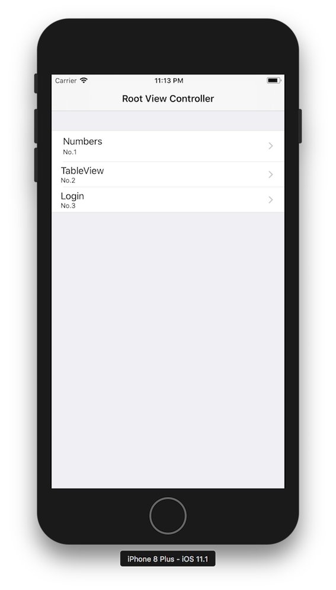

# MySwipeActionTableView

MyRxSwift is Sample code of RxSwift.

## Description
- Functions
  - "Numbers" is addition of three input values.
  - "TableView" does not use UITableViewDataSource, UITableViewDelegate.
  - "Login" is a veridation function.

